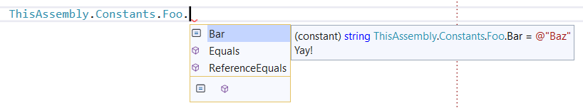
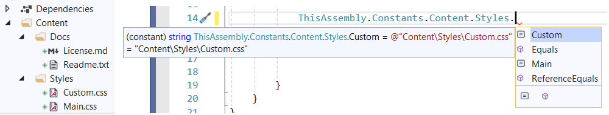

 ThisAssembly
============

[](https://www.nuget.org/packages/ThisAssembly)
[](https://www.nuget.org/packages/ThisAssembly)
[](https://github.com//kzu/ThisAssembly/blob/main/LICENSE)
[](https://github.com/kzu/ThisAssembly/actions)
[](https://pkg.kzu.io/index.json)


Exposes project and assembly level information as constants in the ThisAssembly 
class using source generators powered by Roslyn.

The main generated entry point type is `ThisAssembly` in the global namespace, 
and is declared as partial so you can extend it too with manually created members.

Each package in turn extends this partial class too to add their own constants.

The [ThisAssembly](https://nuget.org/packages/ThisAssembly) meta-package includes 
all the other packages for convenience.

> NOTE: as of .NET 5.0, only C# is supported for source generators.

## ThisAssembly.AssemblyInfo

[](https://www.nuget.org/packages/ThisAssembly.AssemblyInfo)
[](https://www.nuget.org/packages/ThisAssembly.AssemblyInfo)

This package generates a static `ThisAssembly.Info` class with public 
constants exposing the following attribute values generated by default for SDK style projects:

* AssemblyConfigurationAttribute
* AssemblyCompanyAttribute
* AssemblyTitleAttribute
* AssemblyDescriptionAttribute
* AssemblyProductAttribute
* AssemblyCopyrightAttribute

* AssemblyVersionAttribute
* AssemblyInformationalVersionAttribute
* AssemblyFileVersionAttribute

If your project includes these attributes by other means, they will still be emitted properly 
on the `ThisAssembly.Info` class.


## ThisAssembly.Constants

[](https://www.nuget.org/packages/ThisAssembly.Constants)
[](https://www.nuget.org/packages/ThisAssembly.Constants)

This package generates a static `ThisAssembly.Constants` class with public
constants for `@(Constant)` MSBuild items in the project.



In addition to arbitrary constants via `<Constant ...>`, it's quite useful in particular in test projects, to generate constants for files in the project, so there's also a shorthand for those:

```xml
  <ItemGroup>
    <FileConstant Include="@(Content)" />
  <ItemGroup>
```

Which results in:




## ThisAssembly.Metadata

[](https://www.nuget.org/packages/ThisAssembly.Metadata)
[](https://www.nuget.org/packages/ThisAssembly.Metadata)

This package provides a static `ThisAssembly.Metadata` class with public 
constants exposing each `[System.Reflection.AssemblyMetadata(..)]` defined for 
the project.


For an attribute declared (i.e. in *AssemblyInfo.cs*) like:

```csharp
  [assembly: System.Reflection.AssemblyMetadataAttribute("Foo", "Bar")]
```

A corresponding `ThisAssembly.Metadata.Foo` constant with the value `Bar` is provided. 
The metadata attribute can alternatively be declared using MSBuild syntax in the project 
(for .NET 5.0+ projects that have built-in support for `@(AssemblyMetadata)` items):

```xml
    <ItemGroup>
      <AssemblyMetadata Include="Foo" Value="Bar" />
    </ItemGroup>
```

## ThisAssembly.Project

[](https://www.nuget.org/packages/ThisAssembly.Project)
[](https://www.nuget.org/packages/ThisAssembly.Project)

This package generates a static `ThisAssembly.Project` class with public 
constants exposing project properties that have been opted into this mechanism by adding 
them as `ThisAssemblyProject` MSBuild items in project file, such as:

```xml
  <PropertyGroup>
    <Foo>Bar</Foo>
  </PropertyGroup>
  <ItemGroup>
    <ThisAssemblyProject Include="Foo" />
  </ItemGroup>
```


## ThisAssembly.Strings

[](https://www.nuget.org/packages/ThisAssembly.Strings)
[](https://www.nuget.org/packages/ThisAssembly.Strings)


This package generates a static `ThisAssembly.Strings` class with public 
constants exposing string resources in .resx files or methods with the right number of 
parameters for strings that use formatting parameters. 

In addition, it groups constants and methods in nested classes according to an optional 
underscore separator to organize strings. For example, *User_InvalidCredentials* can be
accessed with *ThisAssembly.Strings.User.InvalidCredentials* if it contains a simple string, 
or as a method with the right number of parametres if its value has a format string.

Given the following Resx file:

| Name                          | Value                                 | Comment           |
|-------------------------------|---------------------------------------|-------------------|
| Infrastructure_MissingService | Service {0} is required.              | For logging only! |
| Shopping_NoShipping           | We cannot ship {0} to {1}.            |                   |
| Shopping_OutOfStock           | Product is out of stock at this time. |                   |

The following code would be generated:

```csharp
partial class ThisAssembly
{
    public static partial class Strings
    {
        public static partial class Infrastructure
        {
            /// <summary>
            /// For logging only!
            /// => "Service {0} is required."
            /// </summary>
            public static string MissingService(object arg0)
                => string.Format(CultureInfo.CurrentCulture, 
                    Strings.GetResourceManager("ThisStore.Properties.Resources").GetString("MissingService"), 
                    arg0);
        }

        public static partial class Shopping
        {
            /// <summary>
            /// => "We cannot ship {0} to {1}."
            /// </summary>
            public static string NoShipping(object arg0, object arg1)
                => string.Format(CultureInfo.CurrentCulture, 
                    Strings.GetResourceManager("ThisStore.Properties.Resources").GetString("NoShipping"), 
                    arg0, arg1);

            /// <summary>
            /// => "Product is out of stock at this time."
            /// </summary>
            public static string OutOfStock
                => Strings.GetResourceManager("ThisStore.Properties.Resources").GetString("OutOfStock");
        }
    }
}
```

# Dogfooding

[](https://pkg.kzu.io/index.json)
[](https://github.com/kzu/stunts/actions?query=branch%3Amain+workflow%3Abuild+)
[](http://build.azdo.io/kzu/oss/45)

We also produce CI packages from branches and pull requests so you can dogfood builds as quickly as they are produced. 

The CI feed is `https://pkg.kzu.io/index.json`. 

The versioning scheme for packages is:

- PR builds: *42.42.42-pr*`[NUMBER]`
- Branch builds: *42.42.42-*`[BRANCH]`.`[COMMITS]`


